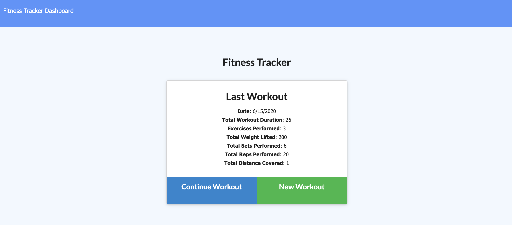

# Fitness-Tracker

## Description

This is a fitness-tracker application. Users can create a workout regimen, add excerices to a current regimen, and view workout stats. This application was created using MongoDB, Mongoose, Node, Express, Javascript, Jquery, HTML, and CSS

## Table of Contents

* [Description](#description)
* [User Story](#user-story)
* [Installation](#installation)
* [Usage](#usage)
* [License](#license)
* [Contributing](#contributing)
* [Tests](#tests)
* [Questions](#questions)
* [Deployed Application URL](#deployed-application-URL)

## User Story

As a user, I want to be able to view create and track daily workouts. I want to be able to log multiple exercises in a workout on a given day. I should also be able to track the name, type, weight, sets, reps, and duration of exercise. If the exercise is a cardio exercise, I should be able to track my distance traveled.

## Installation

No installation needed

## Usage

The deployed application link will take you to the homepage. The homepage will display your previous workout summary, if any. If there is no previous workout then click on new workout to set up a new workout regimen. If there is a previous workout you can click on continue workout to add more excercises to that workout regimen or start a new workout. Click on fitness tracker to view stats on your previous workout.

## License

## Contributing

Please follow standard contributing guidelines.

## Tests

No tests to run.

## Questions

For any questions, please contact kendayao at kendayao@gmail.com

## Deployed Application URL

